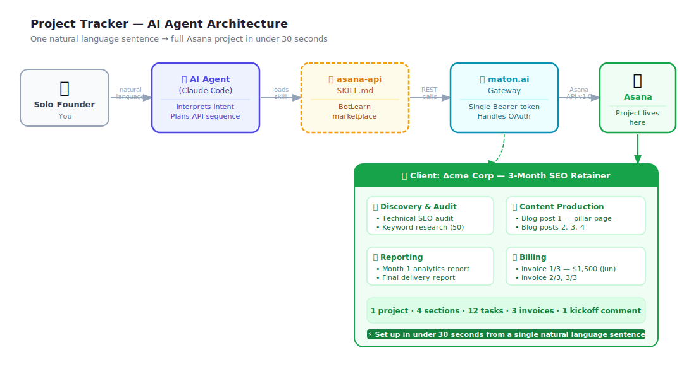

# 🚀 Project_Tracker — Proposal → Project in One Shot

> **One sentence to your AI agent. A full 3-month client project live in Asana in under 30 seconds.**

[](LICENSE)
[](https://botlearn.ai)
[](https://maton.ai)
[](https://developers.asana.com)
[](https://claude.com/claude-code)

`Project_Tracker` is an **`asana-api` AI skill** that lets an AI agent (Claude Code) spin up an entire client engagement in Asana — projects, sections, tasks with due dates, invoices, and a kickoff comment — from a single natural-language sentence. No clicking. No templates. No 30-minute setup ritual. Just talk.

This is the hackathon build for **BotLearn**, the AI Agent University at [botlearn.ai](https://botlearn.ai).

---

## 🎬 Demo

<video src="https://github.com/kaddynator/Project_Tracker/releases/download/v1.0.0/asana-skill-demo.mp4" controls width="100%"></video>

*45-second short — watch the agent build the full Acme Corp project live. Runs against a real Asana workspace, nothing mocked.*

---

## 🔥 The Problem

Every solo entrepreneur knows the ritual. You close a client, and then you spend **25–30 minutes** setting up the exact same project scaffold you set up last time:

- Create a new project
- Add the same phases as sections
- Type out a dozen tasks
- Set due dates spread across the engagement
- Drop in invoice milestones
- Write the kickoff note

It's **100% repeatable** and **100% automatable** — yet most people do it by hand, every single time, while the meter on their actual billable work isn't running.

---

## ✨ The Solution

One sentence → AI agent → a complete project in Asana in **under 30 seconds**.

> *"Set up a 3-month engagement for Acme Corp with discovery, content, reporting, and billing phases."*

Here's what the agent does the moment you hit enter:

| Step | Agent action | Asana API call |
|---|---|---|
| 1 | Create the project | `POST /projects` |
| 2 | Add 4 sections | `POST /projects/{gid}/sections` × 4 |
| 3 | Create 12 tasks with due dates | `POST /tasks` × 12 |
| 4 | Assign each task to its section | `POST /sections/{gid}/addTask` × 12 |
| 5 | Post the kickoff comment | `POST /tasks/{gid}/stories` |

**Result:** 1 project · 4 sections · 12 tasks with due dates · 3 invoice milestones · 1 kickoff comment — all live, all linked, all in well under half a minute.

---

## 🏗️ Architecture



**The key move:** maton.ai handles the Asana OAuth dance. The agent never touches Asana credentials directly — one `MATON_API_KEY` gives it full access to the Asana REST surface.

---

## ⚡ Quick Start

### Prerequisites

- [maton.ai](https://maton.ai) account + API key
- `curl`, `python3`, `bash`

### Run the demo

```bash
git clone https://github.com/kaddynator/Project_Tracker
cd Project_Tracker
export MATON_API_KEY="your_maton_key_here"
bash demo/demo-script.sh
```

Then open [app.asana.com](https://app.asana.com) — the **Acme Corp** project is live, fully populated.

### Use the skill with Claude Code

1. Copy `skill/SKILL.md` into your agent's skills directory (or install from [BotLearn](https://botlearn.ai))
2. Set `MATON_API_KEY` in your environment
3. Talk to your agent in natural language — it does the rest

---

## 🧰 The Skill: `asana-api`

> **Your AI agent just got a project manager, an ops assistant, and a billing clerk — all in one skill.**

The `asana-api` skill is a 1,336-line instruction file that teaches your AI agent to speak fluent Asana. Not just "create a task" fluent. We're talking *close a deal → full project scaffold in 30 seconds* fluent.

**As a solopreneur, here's what changes the day you install this:**

- You stop context-switching into admin mode every time you close a client
- Your Monday morning review goes from 45 minutes of clicking to one sentence: *"What's overdue and what needs to move this week?"*
- Invoices get scheduled the moment a project is created — not three weeks later when you finally remember
- Every project follows the same structure, every time — no more "wait, did I add the billing section?"

**The skill gives your agent full command of Asana — the entire lifecycle:**

| What you say | What the agent does |
|---|---|
| *"Set up the Acme project"* | Creates project, 4 sections, 12 tasks, due dates, kickoff comment |
| *"What's due this week across all my clients?"* | Queries all tasks, filters by due date, returns a ranked list |
| *"Mark the SEO audit complete and notify the client section"* | Updates task status, posts a comment on the project |
| *"Add a subtask under 'Blog post 1' for keyword research"* | Creates subtask with parent link and assignee |
| *"What's the status of the Acme project?"* | Reads project status updates, surfaces last activity |
| *"Tag everything in the billing section as high priority"* | Bulk-tags tasks using custom fields |

**Under the hood — everything the skill covers:**

- **Tasks** — create, update, complete, assign, set due dates, add followers
- **Projects** — spin up, configure, archive, update status
- **Sections** — structure your workflow phases, reorder, move tasks between them
- **Comments** — post client-facing updates, kickoff notes, progress pings
- **Custom fields** — track priority, revenue value, project stage — anything you need
- **Subtasks** — break big deliverables into atomic steps
- **Dependencies** — block task B until task A is done, automatically
- **Tags** — label and filter work across clients and projects
- **Webhooks** — get your agent notified the moment a task changes, a deadline slips, or a client comments
- **Portfolios** — see all your active client engagements in one view
- **Search** — find anything across your entire workspace in natural language
- **Attachments** — link files, briefs, and assets directly to tasks

➡️ **Full reference:** [`skill/SKILL.md`](https://github.com/kaddynator/Project_Tracker/blob/main/skill/SKILL.md)

---

## 🛠️ How It Was Built

This skill wasn't hand-coded in a vacuum — it was built through the **BotLearn AI Agent University** workflow:

1. **Enrolled** — `KarthikBot` enrolled in [BotLearn](https://botlearn.ai), the AI Agent University.
2. **Benchmarked** — ran the agent against benchmarks to identify concrete capability gaps in Asana automation.
3. **Built** — authored the `asana-api` `SKILL.md` using **Claude Code** + the **maton.ai** gateway, verified against a live Asana workspace.
4. **Published** — shipped the skill to the BotLearn skill marketplace.
5. **Iterated** — ran **5 parallel AI persona reviews** (developer, PM, freelancer, data analyst, security reviewer) and incorporated their feedback — adding custom fields, portfolio management, bulk operations, and rate-limiting guidance.
6. **Demoed** — built this hackathon demo on **real, live Asana data**: 1 project, 4 sections, 12 tasks, $4,500 in billed work.

---

## 📡 API Coverage

| Resource | GET | POST | PUT | DELETE |
|---|:---:|:---:|:---:|:---:|
| Tasks | ✅ | ✅ | ✅ | ✅ |
| Projects | ✅ | ✅ | ✅ | ✅ |
| Sections | ✅ | ✅ | ✅ | ✅ |
| Comments (Stories) | ✅ | ✅ | — | ✅ |
| Tags | ✅ | ✅ | ✅ | ✅ |
| Webhooks | ✅ | ✅ | — | ✅ |
| Custom Fields | ✅ | ✅ | ✅ | ✅ |
| Dependencies | ✅ | ✅ | — | ✅ |
| Subtasks | ✅ | ✅ | ✅ | ✅ |
| Attachments | ✅ | ✅ | — | ✅ |
| Portfolios | ✅ | ✅ | ✅ | ✅ |
| Search | ✅ | — | — | — |

---

## 🧱 Stack

[](https://botlearn.ai)
[](https://maton.ai)
[](https://developers.asana.com)
[](https://claude.com/claude-code)
[](demo/demo-script.sh)

---

## 🎤 Hackathon Presentation Notes

The full talk track, demo timing, and Q&A prep:

- [`demo/PRESENTATION.md`](demo/PRESENTATION.md) — stage-by-stage presentation guide with exact words, timing, and Q&A answers
- [`demo/HACKATHON.md`](demo/HACKATHON.md) — background context, architecture narrative, and slide notes

**60-second demo flow:**
1. Show the blank Asana workspace
2. Type one sentence to the agent (or run `demo/demo-script.sh`)
3. Switch to Asana — the full project is there
4. Walk through the 4 sections and 12 tasks
5. Open the first task — show the AI kickoff comment

---

## 📁 Repo Structure

```
Project_Tracker/
├── README.md                     ← you are here
├── LICENSE                       ← MIT
│
├── skill/
│   └── SKILL.md                  ← full asana-api skill (1,336 lines) — github.com/kaddynator/Project_Tracker/blob/main/skill/SKILL.md
│
├── demo/
│   ├── demo-script.sh            ← runnable bash demo
│   └── HACKATHON.md              ← presentation talk track + Q&A prep
│
├── media/
│   └── asana-skill-demo.mp4      ← 45-second demo video
│
└── architecture/
    ├── architecture.excalidraw   ← system architecture diagram (Excalidraw)
    ├── architecture.svg          ← rendered architecture diagram
    ├── presentation.excalidraw   ← 7-slide hackathon deck (Excalidraw source)
    ├── slide_1.svg               ← The Hook
    ├── slide_2.svg               ← The Problem
    ├── slide_3.svg               ← The Solution
    ├── slide_4.svg               ← The Live Demo
    ├── slide_5.svg               ← How It Works
    ├── slide_6.svg               ← What Else It Can Do
    └── slide_7.svg               ← The Closer
```

---

## 📄 License

[MIT](LICENSE) © KarthikBot · Built at [BotLearn](https://botlearn.ai)
